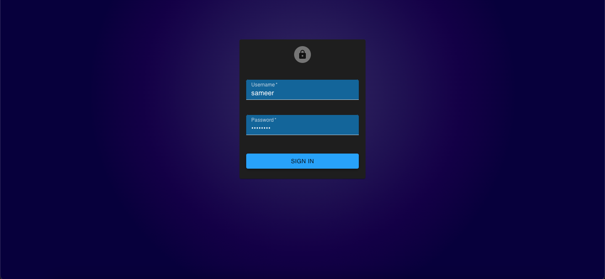
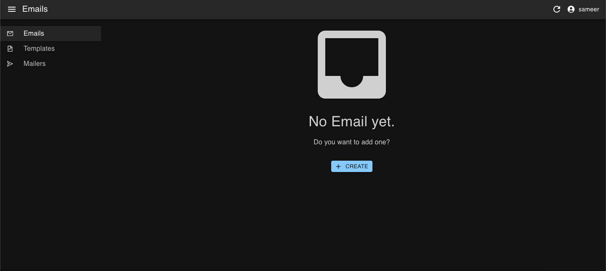

# Mailer App

An App to manange your email campaigns.

## Acknowledgements

- [React Admin](https://marmelab.com/react-admin/)
- [MySQL RCM](https://www.npmjs.com/package/mysql-rcm)

## Authors

- [@sameerwasim](https://github.com/sameerwasim)

## Tech Stack

**Client:** React, React Admin, React Router v6

**Server:** Node, Express, MySQL RCM

## Screenshots




## Environment Variables

To run this project, you will need to add the following environment variables to your .env file

`DATABASE_HOST`
`DATABASE_USER`
`DATABASE_PASS`
`DATABASE_DB`
`JWT_SECRET`
`CRYPTR`

## Run Locally

Clone the project

Import the MySQL file (mailerApp.sql)

Go to the project directory backend

```bash
  cd backend
```

create .env.\* file, Set all secrets inside

- DATABASE_HOST
- DATABASE_USER
- DATABASE_PASS
- DATABASE_DB
- JWT_SECRET
- CRYPTR

Install dependencies

```bash
  npm install
```

Start the server

```bash
  npm run start
```

it automatically starts the server with development mode

Go to the project directory client

```bash
  cd ..
  cd client
```

set backend url inside apiUrl
**path:** /client/src/config/index.js

Install dependencies

```bash
  npm install
```

Start the frontend

```bash
  npm run start
```

the login credentials for the first time are

**user:** sameer / **password:** 12345678

**To create new admin**

you can create a new admin by sending a post request on url **/user/create** with body **{username and password}** also send the auth token in header **x-access-token** which you will get from application local storage

## Support

For support, email me @ sameerwaseem01@gmail.com

## Feedback

If you have any feedback, please reach out to me at sameerwaseem01@gmail.com

## License

[MIT](https://choosealicense.com/licenses/mit/)
